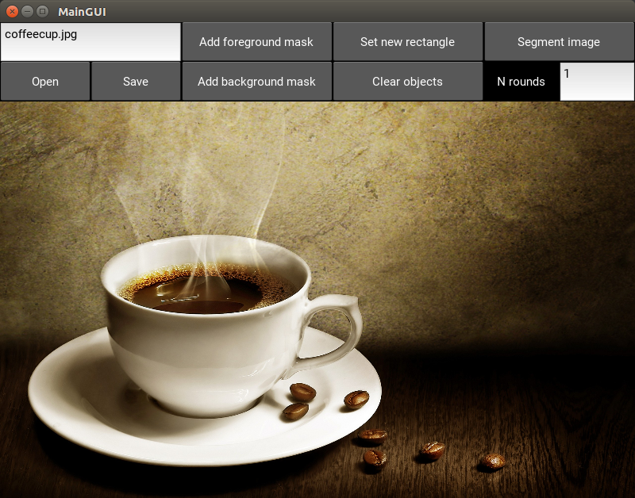
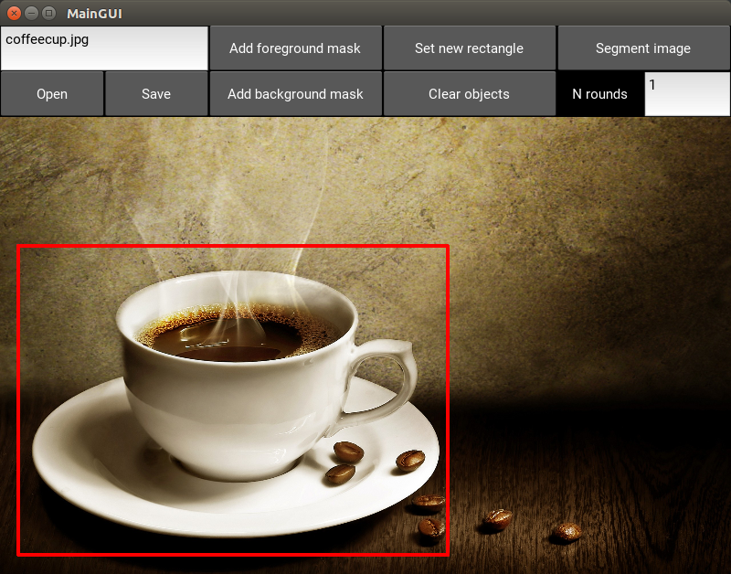
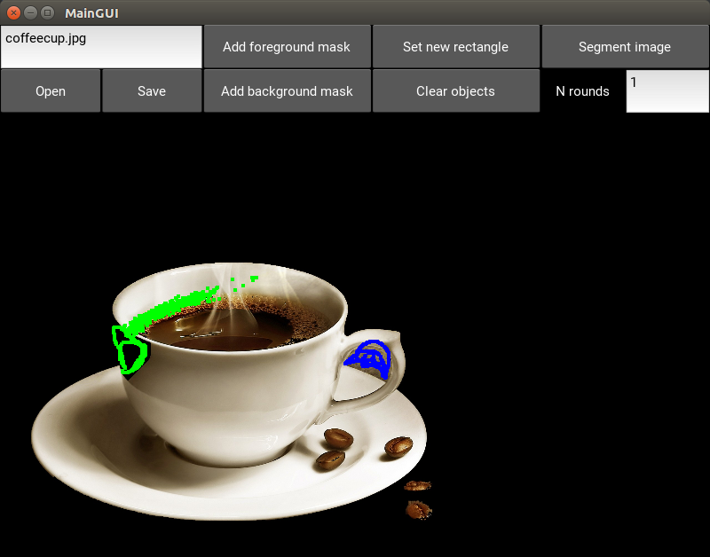
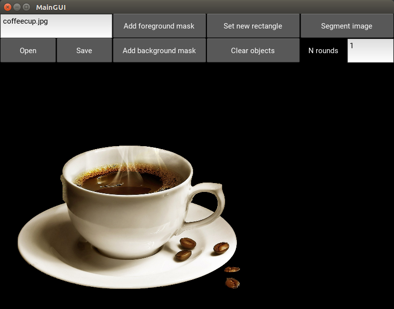

# Task2
Language: python2.7 \
Dependencies:
* Required: openCV, kivy, pygame, numpy

### Usage
```python2 main.py```

1. Load image <p></p>
2. Set bounding box <p></p>
3. Segment image (more rounds -> more time algorithm time, 1 round ~ 12 sec on 4K image) <p></p>
4. Set additional foreground and background information <p></p>
5. Segment an image several more times. <p></p>